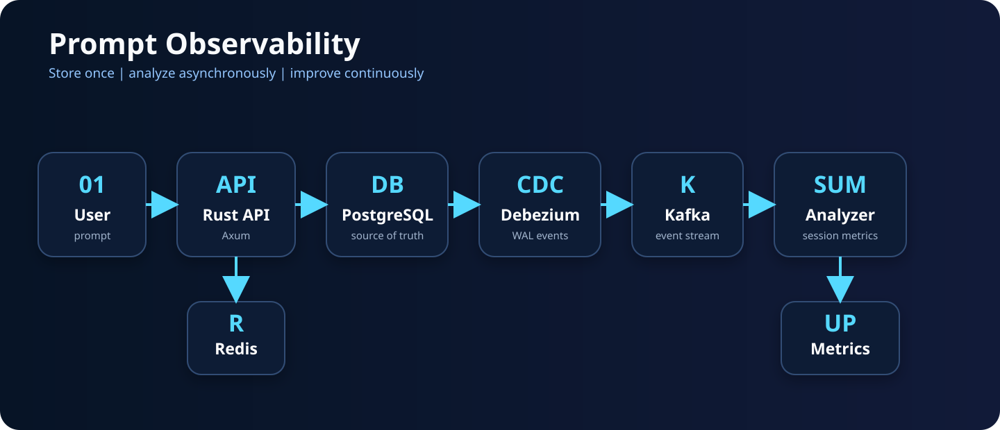
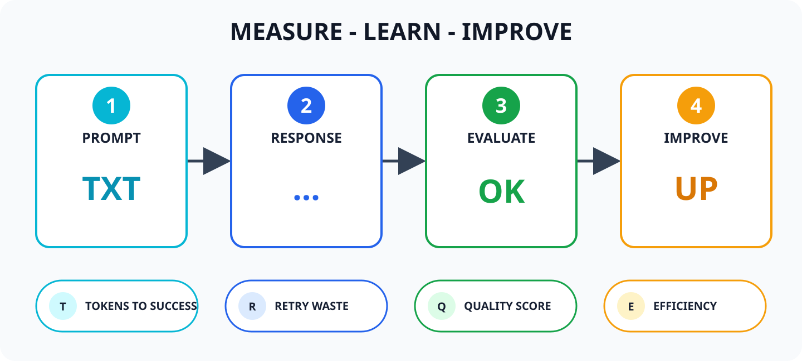
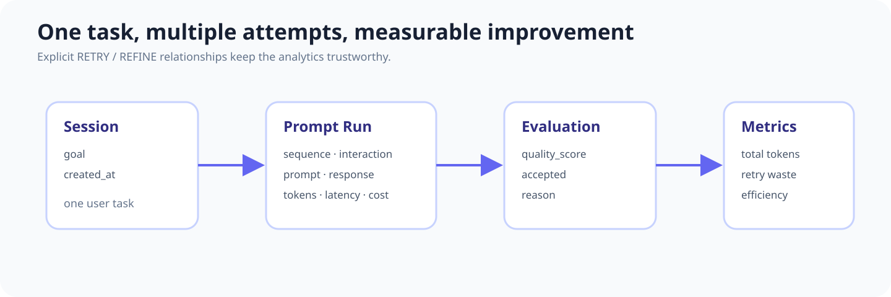
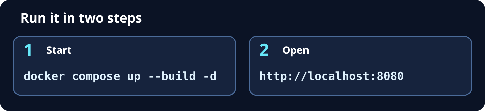

<p align="center">
  
</p>

<p align="center">
  프롬프트의 품질, 토큰, 비용, 재시도 낭비를 측정하는 Rust 기반 LLM 관측 플랫폼
</p>

<p align="center">
  
  
  
  <a href="LICENSE"></a>
</p>

## 무엇을 측정하나요?

<p align="center">
  
</p>

| 지표 | 의미 |
|---|---|
| Tokens to Success | 최초 승인까지 소비한 누적 토큰 |
| Retry Waste | 성공 전 실패한 시도에 사용된 토큰 |
| Quality Score | 사용자가 평가한 결과 품질 |
| Efficiency | 품질 대비 토큰 효율 |

## 데이터 구조

<p align="center">
  
</p>

`NEW_TASK`, `RETRY`, `REFINE`을 명시적으로 기록해 서로 다른 작업과 개선 시도를 정확하게 구분합니다.

## 빠른 시작

<p align="center">
  
</p>

```bash
docker compose up --build -d
curl http://localhost:8080/health
```

`.env` 없이 바로 동작하고, DB 테이블은 API가 시작할 때 자동으로 만듭니다.

| 서비스 | 주소 |
|---|---|
| REST API | `http://localhost:8080` |
| PostgreSQL | `localhost:5432` (`prompt` / `prompt`) |

Rust로 직접 실행하려면 DB만 띄우고 `cargo run` 하면 됩니다.

```bash
docker compose up -d postgres
cargo run
```

## 사용 흐름

```bash
# 세션 생성
curl -s localhost:8080/v1/sessions \
  -H 'content-type: application/json' \
  -d '{"goal":"CDC 구축"}'

# 프롬프트 추가 → 예상 토큰과 프롬프트 점수를 즉시 반환
curl -s localhost:8080/v1/sessions/SESSION_ID/runs \
  -H 'content-type: application/json' \
  -d '{"prompt":"Debezium CDC를 구성해줘","interaction":"NEW_TASK"}'

# 사용자 평가 후 세션 효율 확인
curl -s localhost:8080/v1/runs/RUN_ID/evaluate \
  -H 'content-type: application/json' \
  -d '{"quality_score":88,"accepted":true}'
curl -s localhost:8080/v1/sessions/SESSION_ID/metrics
```

## AI API 연결

API 키 없이도 기록과 분석은 모두 동작합니다. 직접 AI를 호출하려면 `.env`에 키만 넣고 다시 띄웁니다.

```bash
cp .env.example .env
```

```env
OPENAI_API_KEY=your_key
OPENAI_MODEL=gpt-5-mini
MODEL_INPUT_USD_PER_MILLION=0
MODEL_OUTPUT_USD_PER_MILLION=0
```

```bash
curl -X POST localhost:8080/v1/runs/RUN_ID/execute
```

## 코드 위치

```text
src/main.rs       REST API + 선택적 AI 호출
src/analysis.rs   프롬프트 점수 + 세션 효율 계산
migrations/       PostgreSQL 스키마 (시작 시 자동 적용)
compose.yaml      postgres + api
```

> 실제 `.env`는 Git에 포함되지 않습니다. 모델 가격은 시점과 모델에 따라 달라지므로 환경변수로 관리합니다.

## 라이선스

이 프로젝트는 [MIT License](LICENSE)로 배포됩니다. 자유롭게 사용, 수정 및 배포할 수 있습니다.
