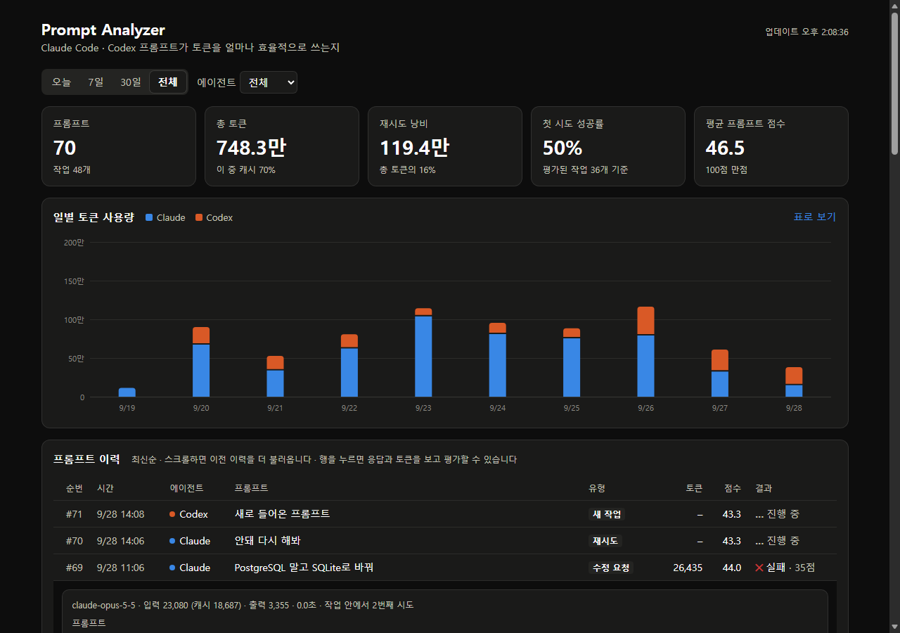

<p align="center">
  
</p>

<p align="center">
  Claude Code · Codex 프롬프트의 토큰, 비용, 재시도 낭비, 품질을 자동으로 기록하는 대시보드 — <b>http://localhost:8080</b>
</p>

대시보드는 요약 지표, 일별 토큰 차트, 프롬프트 이력을 보여줍니다. 이력은 최신순이고, 스크롤하면 이전 기록을 자동으로 더 불러옵니다. 프롬프트마다 사용 모델, 토큰, 비용이 나오며 비용은 열 제목의 `원 / $` 토글로 바꿉니다. 비용은 모델별 API 정가로 계산한 추정치이고(구독 요금제의 실제 청구와는 다릅니다), 원화 환율은 ECB 기준으로 1시간마다 갱신됩니다(`src/pricing.rs`에서 단가 수정). 행을 누르면 응답·토큰·개선 팁을 보고 그 자리에서 성공/실패를 평가할 수 있습니다. 새 프롬프트는 15초마다 자동으로 추가됩니다.

> **AI 에이전트용 설치 안내** — 이 README를 읽은 AI(Claude Code, Codex 등)는 아래를 순서대로 실행하면 됩니다.
>
> 1. 필요한 것: `docker`, `git`, `python3`. Windows에서는 WSL(Ubuntu) 안에서 실행합니다.
> 2. 설치 (이미 받은 저장소라면 `git clone` 줄은 건너뜁니다)
>    ```bash
>    git clone https://github.com/qmdch1/prompt_analyzer.git && cd prompt_analyzer
>    docker compose up --build -d
>    python3 integrations/install.py
>    ```
> 3. 확인: `python3 integrations/install.py --check` 결과가 모두 ✓이면 끝입니다. Codex만 ✗이면, 사용자가 Codex를 켜서 새 훅을 한 번 승인해야 합니다.
> 4. 사용자에게 알릴 것: 대시보드는 http://localhost:8080 이고, 에이전트를 새로 시작하면 기록이 시작됩니다.
>
> `install.py`가 하는 일: Claude Code와 Codex(WSL에서 실행하면 Windows 앱 포함)의 훅 설정(`~/.claude/settings.json`, `~/.codex/hooks.json`)에 `UserPromptSubmit`·`Stop` 훅을 추가하고, MCP 서버 `prompt-analyzer`를 등록합니다. 기존 훅은 건드리지 않고, 여러 번 실행해도 되며, 훅이 실패해도 프롬프트를 막지 않습니다. 되돌리기는 `--uninstall`입니다.

<p align="center">
  
</p>

<p align="center">
  프롬프트의 품질, 토큰, 비용, 재시도 낭비를 측정하는 Rust 기반 LLM 관측 플랫폼
</p>

<p align="center">
  
  
  
  <a href="LICENSE"></a>
</p>

## 무엇을 측정하나요?

<p align="center">
  
</p>

| 지표 | 의미 |
|---|---|
| Tokens to Success | 최초 승인까지 소비한 누적 토큰 |
| Retry Waste | 성공 전 실패한 시도에 사용된 토큰 |
| Quality Score | 사용자가 평가한 결과 품질 |
| Efficiency | 품질 대비 토큰 효율 |

## 프롬프트 점수는 어떻게 매기나요?

프롬프트 글만 보고 규칙으로 바로 계산합니다 (AI 판단이 아닙니다). 세 항목을 비중대로 더합니다.

| 항목 | 비중 | 기본 | 올라가는 조건 |
|---|---|---|---|
| 명확성 | 40% | 45 | 목표가 드러나는 말(목표, 해야, 만들, 분석, 원하는) +20, 단어 수만큼 최대 +35 |
| 구체성 | 35% | 35 | 제약이 드러나는 말(조건, 제약, 반드시, 하지, 형식) +35, 단어 수만큼 최대 +30 |
| 구조 | 25% | 40 | 3줄 이상이거나 목록(`1.`, `-`)이 있으면 +45, 줄 수 × 3 (최대 5줄) |

예를 들어 "커밋하고 푸시해"는 42.5점이고, 목표·제약·출력 형식을 나눠 쓰면 80점 이상이 됩니다. 대시보드에서 프롬프트를 펼치면 점수 구성, 빠진 부분에 대한 개선 팁, 팁을 반영한 **개선 프롬프트**(빈칸 `[ ]`만 채우면 되는 틀)와 예상 점수가 나옵니다. 짧은 대화형 답("했어", "응")은 원래 낮게 나오니 신경 쓰지 않아도 됩니다.

이 점수는 프롬프트 글 자체의 품질 추정이라, 성공 여부나 토큰 효율 지표와는 따로 계산됩니다.

## 데이터 구조

<p align="center">
  
</p>

`NEW_TASK`, `RETRY`, `REFINE`을 명시적으로 기록해 서로 다른 작업과 개선 시도를 정확하게 구분합니다.

## 빠른 시작

<p align="center">
  
</p>

**준비물**: Docker(Windows는 Docker Desktop + WSL2), Git, Python 3(WSL·Ubuntu·Mac에는 기본으로 있습니다), 그리고 쓰는 에이전트(Claude Code / Codex). 에이전트는 먼저 설치하고 로그인해 둡니다. Windows에서는 에이전트와 이 저장소를 모두 WSL(Ubuntu) 안에서 씁니다.

```bash
git clone https://github.com/qmdch1/prompt_analyzer.git
cd prompt_analyzer
docker compose up --build -d          # 서버 + DB (처음 빌드는 몇 분 걸립니다)
python3 integrations/install.py       # Claude Code·Codex 자동 기록 연결
```

`.env` 없이 바로 동작하고, DB 테이블은 API가 시작할 때 자동으로 만듭니다. 브라우저에서 **http://localhost:8080** 을 열면 대시보드가 보입니다.

| 서비스 | 주소 |
|---|---|
| 대시보드 | `http://localhost:8080` |
| REST API | `http://localhost:8080/v1/...` |
| PostgreSQL | `localhost:15432` (`prompt` / `prompt`) |

인증이 없어서 두 주소 모두 이 PC 안에서만 열립니다(다른 PC에서는 접속되지 않습니다).

대시보드는 정적 페이지이고, 데이터는 브라우저의 JS가 API(`/v1/dashboard`, `/v1/prompts`)에서 가져옵니다. 훅이 프롬프트를 실시간으로 DB에 넣기 때문에, 서버만 켜져 있으면 항상 최신 데이터가 보입니다. 서버는 PC나 Docker를 재시작해도 자동으로 다시 뜹니다.

코드를 받아서 업데이트할 때는 다시 빌드합니다. 화면 파일도 서버 안에 함께 들어가 있어서 이 한 줄이면 됩니다.

```bash
git pull && docker compose up --build -d
```

### 다른 PC로 기록 옮기기

기록은 Docker 볼륨(DB)에 있어서 `git clone`으로는 따라오지 않습니다. 옮기려면 기존 PC에서 백업하고,

```bash
docker compose exec -T postgres pg_dump -U prompt -d prompt_analyzer > prompt-analyzer.sql
```

새 PC에서는 서버를 띄우기 **전에** DB만 먼저 켜서 복원한 뒤 나머지를 띄웁니다.

```bash
docker compose up -d --wait postgres
docker compose exec -T postgres psql -q -U prompt -d prompt_analyzer < prompt-analyzer.sql
docker compose up --build -d
```

Rust로 직접 실행하려면 DB만 띄우고 `cargo run` 하면 됩니다.

```bash
docker compose up -d postgres
cargo run
```

## AI 에이전트 자동 연결 (Claude Code · Codex)

서버를 띄우고 설치 스크립트를 한 번 실행하면 끝입니다. 에이전트 코드는 건드리지 않습니다.

```bash
docker compose up --build -d
python3 integrations/install.py
```

그다음 Claude Code나 Codex를 새로 시작하면 모든 프롬프트가 자동으로 기록되고, 대시보드(`http://localhost:8080`)에서 바로 볼 수 있습니다.

| 단계 | 방식 | 하는 일 |
|---|---|---|
| 1. 세션 | 자동 (훅) | 새 작업이면 세션을 새로 열고, 이어지는 요청이면 같은 세션에 붙입니다 |
| 2. 프롬프트 | 자동 (훅) | 보낼 때마다 프롬프트 점수와 예상 토큰을 기록합니다 |
| 3. 응답·토큰 | 자동 (훅) | 답변이 끝나면 실제 입력·출력·캐시 토큰과 응답을 기록합니다 |
| 4. 평가 | 자동 추정 + 말로 | 다음 프롬프트가 "아니 …", "다시 …", "A 말고 B로 …"처럼 **앞부분에서** 고쳐 달라고 하거나 "에러가 나", "안 되는데"처럼 문제를 알리면 이전 시도는 실패, 그 밖에는 성공으로 봅니다(긴 지시문 중간의 단어는 무시). "좋았어 90점"이라고 말하거나 대시보드의 ✓/✕로 직접 평가하면 그게 우선합니다 |

대화 중에 이렇게 쓸 수 있습니다 (MCP 도구).

- **"좋았어 90점"**, **"별로야"** → `rate_last_answer`: 직전 답변을 평가합니다
- **"내 프롬프트 통계 보여줘"** → `prompt_stats`: 최근 작업의 토큰, 재시도 낭비, 성공률과 프롬프트 개선 팁을 보여줍니다
- **"분석기 연결 확인해줘"** → `check_connection`: 지금 보낸 프롬프트가 실제로 기록됐는지까지 확인합니다

연결은 대화 중에 "분석기 연결 확인해줘"라고 물어서 확인할 수 있고, 터미널에서는 이 명령으로 더 자세히 봅니다 (설치 후에는 어느 폴더에서든 `python3 ~/.prompt-analyzer/install.py --check`). 서버, 훅 등록, Codex 승인 여부, MCP, 에이전트별 마지막 기록 시각, 최근 오류를 보여주고, 안 된 항목에는 고치는 방법이 함께 나옵니다.

```bash
python3 integrations/install.py --check
```

알아둘 점

- Codex는 처음 시작할 때 새 훅을 신뢰할지 묻습니다. 한 번 승인해야 기록이 시작됩니다.
- 서버가 꺼져 있어도 에이전트는 평소처럼 동작하고 기록만 빠집니다 (`~/.prompt-analyzer/hook.log`).
- Claude Code의 서브에이전트가 쓴 토큰은 포함되지 않습니다.
- 연결 해제: `python3 integrations/install.py --uninstall`
- 서버 주소가 다르면 설치할 때 지정합니다: `PROMPT_ANALYZER_URL=http://서버:8080 python3 integrations/install.py`

### 다른 에이전트를 직접 연결하려면

LLM 호출 앞뒤로 API를 부르면 됩니다.

```bash
# 1. 세션 생성
curl -s localhost:8080/v1/sessions -H 'content-type: application/json' \
  -d '{"goal":"CDC 구축"}'

# 2. LLM 호출 전: 프롬프트 기록 (점수·예상 토큰 반환)
#    다시 시도하면 "previous_run_id"와 "interaction":"RETRY" 또는 "REFINE"을 넣습니다
curl -s localhost:8080/v1/sessions/SESSION_ID/runs -H 'content-type: application/json' \
  -d '{"prompt":"Debezium CDC를 구성해줘","interaction":"NEW_TASK"}'

# 3. LLM 호출 후: 응답과 실제 토큰 기록
curl -s localhost:8080/v1/runs/RUN_ID/complete -H 'content-type: application/json' \
  -d '{"response":"...","input_tokens":120,"output_tokens":300}'

# 4. 평가 후 지표 확인
curl -s localhost:8080/v1/runs/RUN_ID/evaluate -H 'content-type: application/json' \
  -d '{"quality_score":88,"accepted":true}'
curl -s localhost:8080/v1/sessions/SESSION_ID/metrics
```

| 에이전트가 도는 곳 | API 주소 |
|---|---|
| 내 PC에서 바로 실행 | `http://localhost:8080` |
| 다른 도커 컨테이너 | `http://host.docker.internal:8080` |
| 이 `compose.yaml`에 서비스로 추가 | `http://api:8080` |

> 리눅스 Docker Engine(Docker Desktop 아님)에서 `host.docker.internal`을 쓰려면 에이전트 컨테이너에 `extra_hosts: ["host.docker.internal:host-gateway"]`를 추가합니다.

## OpenAI 직접 호출 (선택)

에이전트 없이 분석기가 OpenAI를 대신 호출하게 할 수도 있습니다. 직접 호출하려면 `.env`에 키만 넣고 다시 띄웁니다.

```bash
cp .env.example .env
```

```env
OPENAI_API_KEY=your_key
OPENAI_MODEL=gpt-5-mini
MODEL_INPUT_USD_PER_MILLION=0
MODEL_OUTPUT_USD_PER_MILLION=0
```

```bash
curl -X POST localhost:8080/v1/runs/RUN_ID/execute
```

## 코드 위치

```text
src/main.rs         REST API + 선택적 AI 호출
src/analysis.rs     프롬프트 점수 + 세션 효율 계산 + 재시도 추정
src/track.rs        에이전트 자동 기록 (훅이 호출)
src/mcp.rs          MCP 서버 (/mcp/claude, /mcp/codex)
src/web.rs          대시보드 API (/v1/dashboard, /v1/prompts)
web/index.html      대시보드 화면 (정적 HTML + JS)
integrations/       Claude Code·Codex 훅과 설치 스크립트
migrations/         PostgreSQL 스키마 (시작 시 자동 적용)
compose.yaml        postgres + api
```

> 실제 `.env`는 Git에 포함되지 않습니다. 모델 가격은 시점과 모델에 따라 달라지므로 환경변수로 관리합니다.

## 라이선스

이 프로젝트는 [MIT License](LICENSE)로 배포됩니다. 자유롭게 사용, 수정 및 배포할 수 있습니다.
